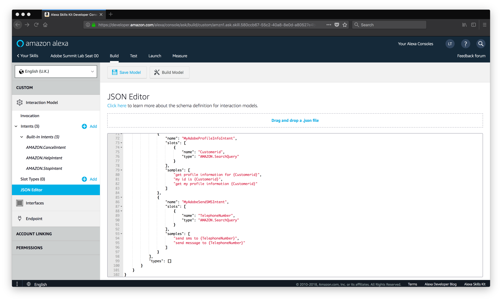
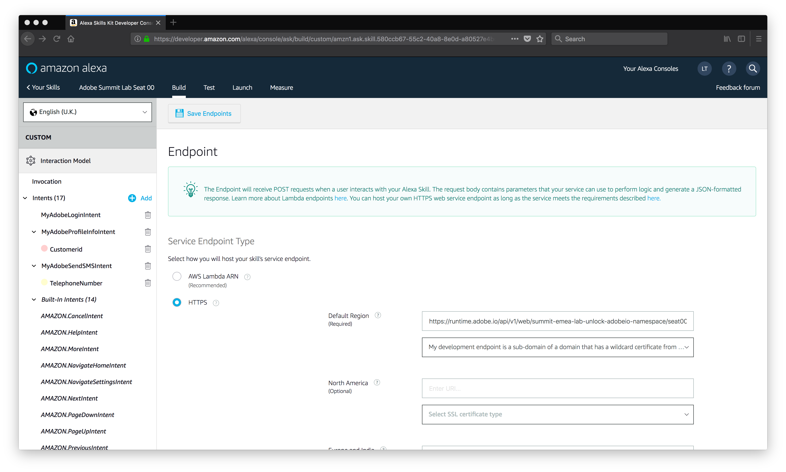
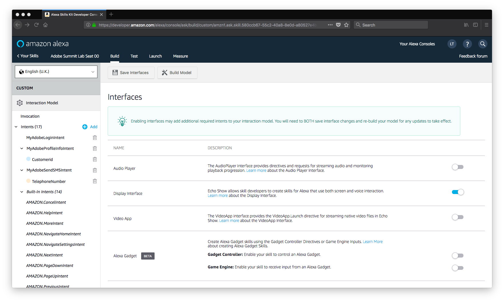
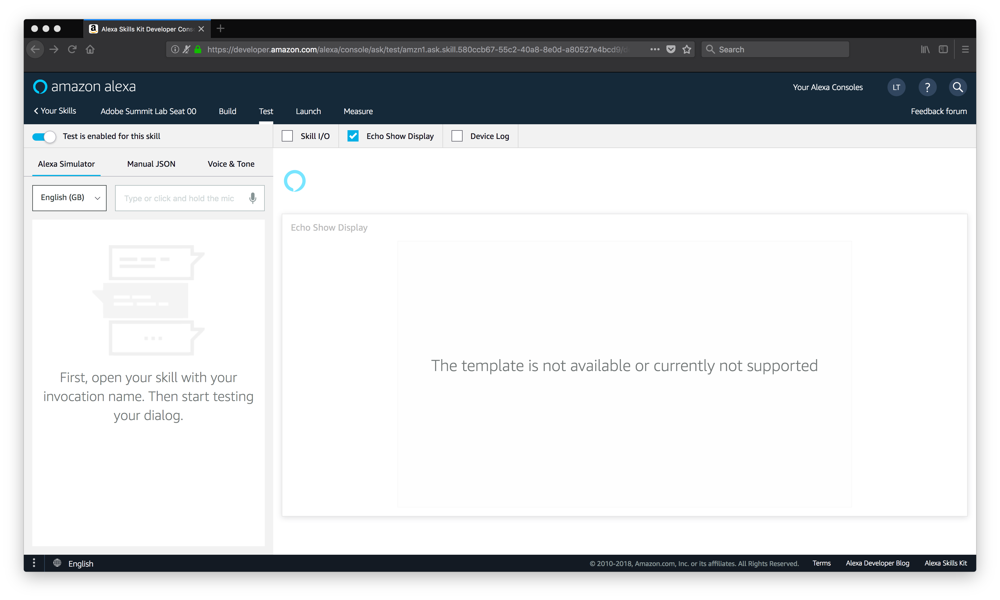
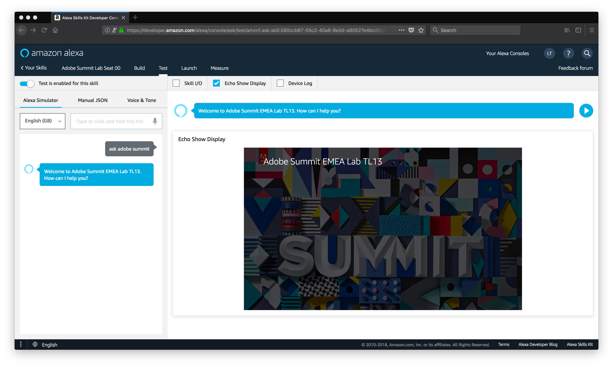
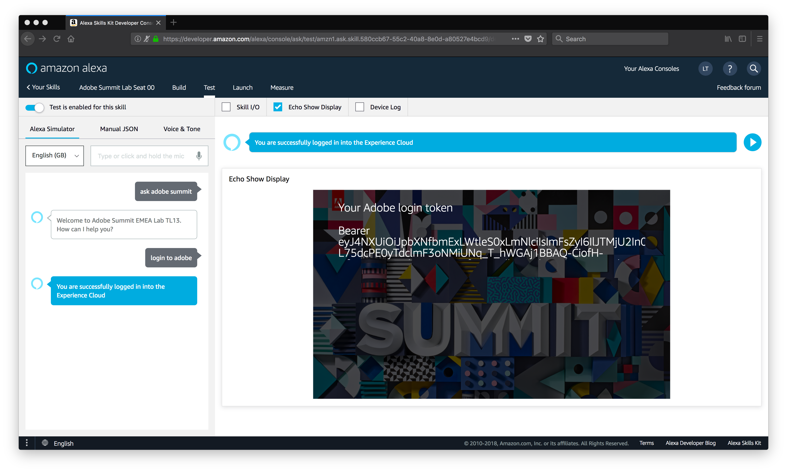
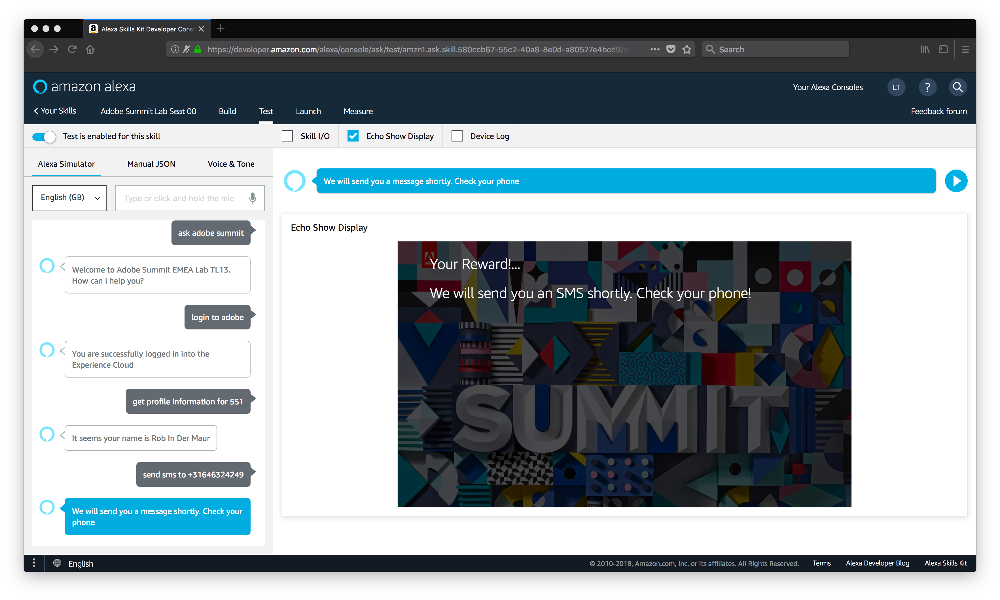
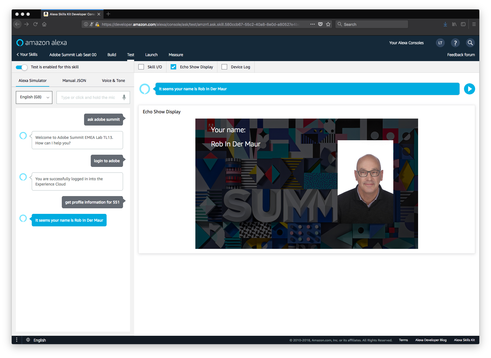

# Invoke Adobe I/O Runtime Actions through Alexa Skills
In this exercise we are going to invoke an Adobe I/O Runtime action through Amazon Alexa skills configured for Amazon devices like Echo Show, Echo Spot, etc. We want to define an Adobe Summit Lab skill, that allow us to login to the Adobe Marketing Cloud, allow us to retrieve our contact/profile from Adobe Campaign Standard and also allow us to send an SMS to a mobile phone number (using Adobe Campaign Standard's transactional message feature).

## Objective
The objective of this exercise is to understand how Adobe I/O Runtime actions can be invoked as part of an Amazon development effort.

## How does it work?
Typically, when you develop an Amazon Alexa skill, you will invoke some serverless functionality that you have defined on AWS Lambda. But we want our Amazon skill to use the serverless functionality that runs within Adobe I/O Runtime.

In order to do this, we first need to define an Adobe I/O Runtime action that implements the functionalities we want to expose to our Alexa skil. This is done by so-called handlers, which define how the interaction will happen and also will call functions that perform the actual integration work. Take a look at *alexa/index.js* and see in the code how it is defined to:
* set up the skill - through the `LaunchRequest` handler (line 46-65);
* log in to the Adobe Marketing Cloud - through the `MyAdobeLoginIntent` handler (line 67-91), which invokes the `doGetAdobeLoginBearer` function (line 199-245).
* retrieve the profile from Adobe Campaign Standard - through the `MyAdobeProfileInfoIntent` handler (line 93-142), which invokes the `doGetProfileInfo` function (line 247-283).
* send a SMS to a mobile phone number - through the `MyAdobeSendSMSIntent` handler (line 144-168); which invokes the `doSendSMS` function (line 285-318).

Once that code in place, we need to link that action with our Alexa skill and then deploy the action in Adobe I/O Runtime.
Then we have to configure our Alexa skill to invoke our Adobe I/O Runtime action. Obviously, we also have to set up our Alexa skill with an interaction model (defining intents, etc.) but we will not go in-depth on that part as that is more related to Amazon Alexa development rather than Adobe I/O capabilities.

## Try It!

### Get Your Skill Id
We first need to figure out what will be our Amazon skill id. To do this:
* Login to your Amazon Developer console.
* Hover over **Your Alexa Consoles**, and then select **Skills**. If you don't see *Your Alexa Consoles*, click on **Developer Console** and then on **Alexa Skills Kit**.
* In the list of skills, find the **Adobe Summit Lab Seat XX** skill that belongs to your seat. Copy the skill id, by clicking on the copy icon left from the id underneath your skill.

### Modify Action
We need to edit our code for the action. Make sure you are in the *alexa* directory, and then modify line 189 in *index.js*, so it is updated with your Adobe Summit Lab Seat XX skill id. For example:
```
  alexa.appId = "amzn1.ask.skill.00000000-0000-0000-0000-000000000000";
```

### Create Action
This action uses the Alexa SDK. Adobe I/O Runtime actions are limited to 1MB in size. Just incorporating the whole Alexa SDK in this action would not fit within that limitation so we use some advanced Javascript technology (e.g. webpack) to compress our final package. In order to do this, ensure you are in the *alexa* directory and submit the following command:
```
$ npm run build
```
This will build the final code in *dist/bundle.js*.

Now create the action, using the following command:
```
$ wsk action create seatXX/adobesummit --kind nodejs:6 --web true  dist/bundle.js   
```

### Configure Your Skill
We need to configure our skill with the proper interaction model, and (more importantly) ensure it will invoke our Adobe I/O Runtime action. To do this:
* Back into the Amazon Developer Console, click on your skill name.

#### Configure Interaction Model
We need Alexa to tell how we want to interact with her. This is defined in a so-called interaction model, consisting of slots and intents. We made it simple for you: all this interaction is defined in a .json file. To load this:
1. Click on **JSON Editor** in the left rail.
2. Drag and drop the *alexa-skill/adobesummit.json* file from your local repository onto the **drag and drop a .json file** area in the main pane. If you scroll down into the editor window, you will now see your interactions defined (see screenshot below).

3. Click on **Save Model**, then click on **Build Model**. After a while you will see a *Build Successful* popup.

#### Configure Endpoint
1. Click on **Endpoint** in the left rail (you might have to scroll down a bit to see that).
2. In the main pane, scroll up to see the definition of *Endpoints*.
3. Define the endpoint of type HTTPS
4. Provide `https://runtime.adobe.io/api/v1/web/summit-emea-lab-unlock-adobeio-namespace/seatXX/adobesummit` as input for *Enter URI...* and select **My development environment is a sub-domain of a ...** from the *Select SSL Certificate Type* drop-down list. You should know by now what to do with the `XX` in the URL... :smile:. Your screen should look like below:

5. Click on **Save Endpoint**. You will see a *Skill Manifest Saved Successfully* popup.

#### Configure Interfaces
We also need to tell our skill what will be the interface (voice only, voice and display, etc). To configure this:
1. Click on **Interfaces** in the left rail.
2. Enable the *Display Interface*. Your screen should look like.

3. Click on **Save Interfaces** and then on **Build Model** to rebuild the model.

#### Configure Invocation
Final step is to configure how to invoke our skill. To do this:
1. Click on **Invocation**.
2. It should read *adobe summit lab* as the Skill Invocation Name.
3. Modify it to a skill invocation name, unique for your seat, e.g. `adobe summit seat zero one` (in case you are in seat 01). Note that an invocation name can only contain words and should be unique in order to guarantee it will invoke the right skill.
4. Click on **Save Model** and then on **Build Model** to rebuild the model.

Wait until you see that the build is completed successfully. Then you're ready to test the skill.


### Test Your Skill
To test your skill, use the Alexa simulator. To do this:
#### Configure the simulator
1. Click on **Test** in the toolbar. When prompted to allow to use the microphone of the computer, please do not allow this as this will not work with so many people in the room :smile:.
2. Enable **Test is enabled for this skill**
3. Select **English (GB)** from the language drop-down list.
4. Uncheck **Skill I/O**, **Device Log** and check **Echo Show Display** and.or **Echo Spot Display**. Your screen should now look like


#### Use the simulator
1. Enter `ask adobe summit lab` in the *Type or click and hold the mic'* text box. You will see a dialog coming back from Alexa.

2. Enter `login to adobe`

3. Enter `get profile information for <id>`. Use here the CRM Id that is associated with your Adobe Campaign Standard profile and was returned by Hubspot CRM, as part of the Sequence exercise.

4. Enter `send sms to <phone_number>`



## What's Next?
Actually nothing, you've finished the lab :smile:. If you have time left, you can try out the following:
* Go to Adobe Campaign Standard and update the profile picture for your profile. You do this through the following steps:
  1. Open the profile (click on the entry). A profile detail page will show.
  2. Click on the pencil at the top right and replace the image with a profile picture. Click on **Save** to save the profile picture.
* Retry the simulator. You should see the picture of the profile being displayed in the simulator when you ask for the profile information.

* Figure out in the code how that picture is actually being retrieved from Adobe Campaign Standard and displayed in the simulator.

Thank you for attending the lab. Hope you have enjoyed it.
