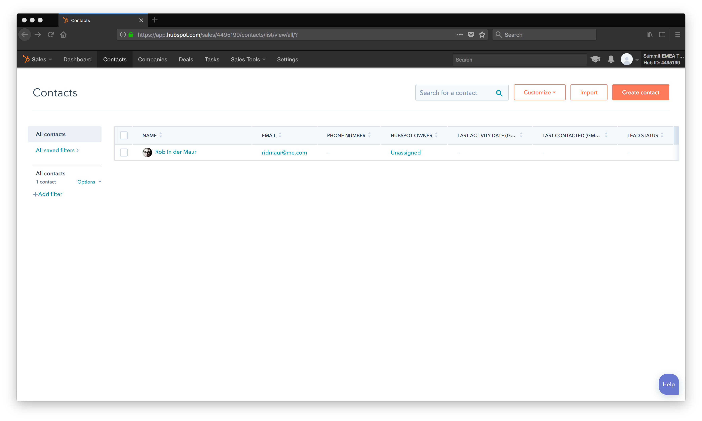

# Using Hubspot with Adobe I/O Runtime
In essence, Adobe I/O runtime is a lightweight serverless platform where you can deploy all kinds of functions. In this example we are going to make it work with Hubspot CRM and define a function that creates a contact in Hubspot CRM.

## Objective
The objective of this exercise is to understand how Adobe I/O runtime can integrate with 3rd party solutions, like Hubspot CRM.

## How does it work?
The Javascript code to create a contact in Hubspot CRM can be found in *hubspot/createcontact.js*.
Hubspot doesn't require sophisticated authentication; the only thing we need to access the environment through an API, is an API key. You can see that being set in line 16:
````
var apikey = "cc20872a-3077-442f-94fb-f1f11bae2f89";
````
The code will take three input parameters and then use these to send a POST request to Hubspot CRM to invoke the action (line 63 - 80).

## Try It!
### Hubspot Create Contact Action
Ensure you are in the *hubspot* directory. To create the Hubspot CRM Create Contact action in Adobe I/O runtime, you need to do the following (where you replace **_XX_** with your seat number):
```
$ wsk action create seatXX/createcontact createcontact.js -v
```
The `-v` parameter enables verbose output.
If all is ok, you should see the verbose output, ending with
```
$ ok: created action seatXX/createcontact
```

### Invoke Hubspot Create Contact Action
You invoke the action through the command line. Ensure you replace placeholder values (like `<firstname>` etc.) in the example below with your actual values.

```
$ wsk action invoke seatXX/createcontact --param email "<email address>" --param firstname "<firstname>" --param lastname "<lastname>"
```
If all goes well, you will see output like below:
```
$ ok: invoked /summit-emea-lab-unlock-adobeio-namespace/seatXX/createcontact with id <id>
```
The id `<id>` is important as this is an entry to give you more information about your activation. To do this, use the following command
```
$ wsk activation get <id>
```
It will show you output like below:
```
{
    "namespace": "summit-emea-lab-unlock-adobeio-namespace",
    "name": "createcontact",
    "version": "0.0.1",
    "subject": "summit-emea-lab-unlock-adobeio-namespace",
    "activationId": "8431e4334a6e407eb1e4334a6e507eb5",
    "start": 1524217160818,
    "end": 1524217161077,
    "duration": 259,
    "response": {
        "status": "success",
        "statusCode": 0,
        "success": true,
        "result": {
            "cusCrmId": 401,
            "email": "ridmaur@me.com",
            "firstName": "Rob",
            "lastName": "In der Maur"
        }
    },
    "logs": [
        "2018-04-20T09:39:20.832952371Z stdout: JSON: {\"properties\":[{\"property\":\"firstname\",\"value\":\"Rob\"},{\"property\":\"lastname\",\"value\":\"In der Maur\"},{\"property\":\"email\",\"value\":\"ridmaur@me.com\"}]}"
    ],
    "annotations": [
        {
            "key": "limits",
            "value": {
                "logs": 10,
                "memory": 256,
                "timeout": 60000
            }
        },
        {
            "key": "path",
            "value": "summit-emea-lab-unlock-adobeio-namespace/seat00/createcontact"
        },
        {
            "key": "kind",
            "value": "nodejs:6"
        },
        {
            "key": "waitTime",
            "value": 283
        }
    ],
    "publish": false
}
```
**Important**: You will need the CRM ID from Hubspot in the next exercise of this lab, so take note of the `cusCrmId` value (`401` in the example above).


### Check Hubspot
To check whether your contact has made it into Hubspot, go to the Hubspot. In Hubspot, click on **Contacts** at the top menu bar. You will see something like the screenshot below, and if all is ok, you will see your contact in the list:


## Additional Info
As you have seen you can create an action using 
```
wsk action create ...
```
If you have made code changes (e.g. modified *createcontact.js*) after creating the action, you can simply update your action by using
```
wsk action update ...
```
And if you want to delete your action, you simply use
```
wsk action delete ...
```
If you need more info on the syntax, simply use `wsk action --help` or `wsk action delete --help`, etc.

## What's Next?
* [Exercise 3: Using Adobe Campaign Standard with Adobe I/O Runtime](../acs/)


